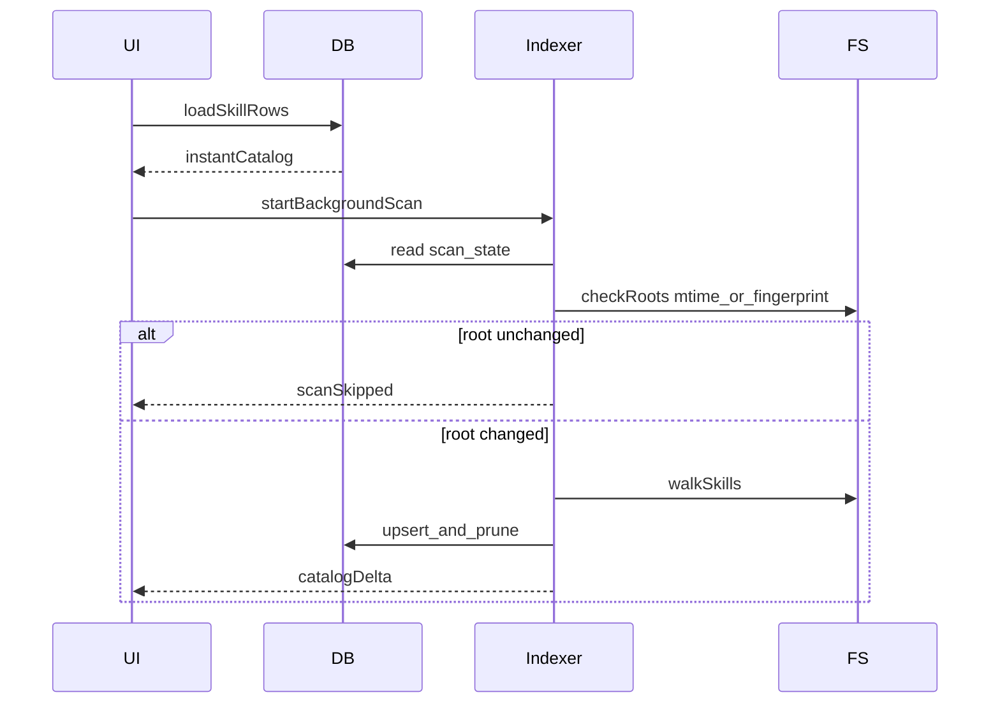

# 03 — 数据模型与增量索引策略

配套 Schema：[`schemas/skill-catalog.schema.json`](../schemas/skill-catalog.schema.json)

## 1. 存储分层

| 层 | 用途 | 建议形态 |
|----|------|----------|
| 元数据索引 | 列表、筛选、副本关系 | SQLite（或等价嵌入式库） |
| 正文 | 详情渲染 | 文件系统按需读取，不常驻内存 |
| 应用状态 | Bundle、项目根、设置、OpLog | SQLite 表 或 旁路 JSON（Bundle 导出用 JSON） |
| 缓存 | Markdown 渲染 AST（可选） | 内存 LRU，进程退出丢弃 |

原则：**UI 列表只绑索引行；打开详情才读 `SKILL.md`。**

## 2. 实体定义

### 2.1 SkillRecord（索引行）

| 字段 | 类型 | 说明 |
|------|------|------|
| `id` | string | 稳定 ID：`sha256(normalized_realpath)` 前 32 hex，或 uuid + path 唯一约束 |
| `name` | string | frontmatter.name，缺省则用目录名 |
| `description` | string | frontmatter.description |
| `dirPath` | string | Skill 目录绝对路径 |
| `entryPath` | string | `SKILL.md` 绝对路径 |
| `realpath` | string | 解析 symlink 后的真实路径 |
| `isSymlink` | bool | 入口或目录是否为链接 |
| `sourceId` | string | 对应 sources 配置 id |
| `runtime` | enum | cursor / claude / agents / … |
| `scope` | enum | global / project |
| `origin` | enum | local / builtin / plugin / skills_sh |
| `access` | enum | readonly / readwrite |
| `projectRoot` | string? | scope=project 时必填 |
| `contentHash` | string | 目录内容指纹（见下） |
| `entryMtimeMs` | number | SKILL.md mtime |
| `hasScripts` | bool | 存在 `scripts/` |
| `frontmatterFlags` | object | 如 `{ "disableModelInvocation": true }` |
| `tags` | string[] | 用户标签 |
| `favorite` | bool | 收藏 |
| `twinGroupId` | string? | 副本组 ID |
| `healthScore` | number? | P1 |
| `indexedAt` | number | 上次成功索引时间 |
| `error` | string? | 解析失败原因 |

**contentHash 算法（规划定稿）：**

1. 枚举 skill 目录下文本相关文件（`SKILL.md`、`*.md`、`scripts/**`），按相对路径排序  
2. 对每个文件：`path + '\0' + sha256(fileBytes)`  
3. 再对拼接结果做 sha256  

同 `contentHash` ⇒ 内容完全一致；同 `name` 不同 hash ⇒ 漂移候选。

### 2.2 TwinGroup（副本组）

| 字段 | 说明 |
|------|------|
| `id` | 组 ID |
| `keyType` | `name` \| `contentHash` \| `both` |
| `key` | 分组键 |
| `skillIds` | 成员 |
| `status` | `identical` \| `diverged` \| `mixed` |

规则：

- 先按 `contentHash` 聚「完全一致」  
- 再按规范化 `name` 把不同 hash 链成「漂移组」  
- UI 优先展示 name 组，组内标注 hash 簇

### 2.3 Bundle

| 字段 | 类型 | 说明 |
|------|------|------|
| `id` | string | uuid |
| `name` | string | 显示名 |
| `description` | string? | |
| `items` | BundleItem[] | |
| `defaultRuntimes` | string[] | 应用到项目时的默认写入目标 |
| `createdAt` / `updatedAt` | number | |
| `version` | number | 导出兼容 |

**BundleItem：**

| 字段 | 说明 |
|------|------|
| `skillRef` | `{ "by": "id", "value": "..." }` 或 `{ "by": "name+hash", "name", "contentHash" }` |
| `optional` | 应用时是否可跳过缺失 |

导出 JSON 优先 `name+hash`，跨机器更稳；本机应用可用 `id`。

### 2.4 ProjectRoot

| 字段 | 说明 |
|------|------|
| `id` | |
| `path` | 绝对路径 |
| `displayName` | |
| `lastUsedAt` | Target Project 槽排序 |
| `detectedStacks` | P1：`["node","rust",...]` |

### 2.5 OpLogEntry（操作日志）

| 字段 | 说明 |
|------|------|
| `id` | |
| `ts` | |
| `op` | `copy` \| `move` \| `delete` \| `syncTwin` \| `extractCopy` \| `bundleApply` \| `import` \| `export` |
| `status` | `ok` \| `partial` \| `failed` \| `cancelled` |
| `sources` | 路径列表 |
| `targets` | 路径列表 |
| `detail` | 结构化 JSON（冲突决策、错误信息） |
| `undoToken` | 可选；MVP 可只做日志不做撤销 |

### 2.6 AppSettings（摘录）

- 启用的 `sourceId[]`  
- `multiRuntimeSyncDefault`  
- `conflictPolicyDefault`  
- `dragModifierForMove`  
- `alsoWriteNativeCursor`  
- `recycleBinForDeletes`  
- `externalEditorCommand`  

## 3. SQLite 表草案

```sql
CREATE TABLE skills (
  id TEXT PRIMARY KEY,
  name TEXT NOT NULL,
  description TEXT NOT NULL DEFAULT '',
  dir_path TEXT NOT NULL UNIQUE,
  entry_path TEXT NOT NULL,
  realpath TEXT NOT NULL,
  is_symlink INTEGER NOT NULL DEFAULT 0,
  source_id TEXT NOT NULL,
  runtime TEXT NOT NULL,
  scope TEXT NOT NULL,
  origin TEXT NOT NULL,
  access TEXT NOT NULL,
  project_root TEXT,
  content_hash TEXT NOT NULL,
  entry_mtime_ms INTEGER NOT NULL,
  has_scripts INTEGER NOT NULL DEFAULT 0,
  frontmatter_json TEXT NOT NULL DEFAULT '{}',
  tags_json TEXT NOT NULL DEFAULT '[]',
  favorite INTEGER NOT NULL DEFAULT 0,
  twin_group_id TEXT,
  health_score REAL,
  indexed_at INTEGER NOT NULL,
  error TEXT
);

CREATE INDEX idx_skills_name ON skills(name);
CREATE INDEX idx_skills_hash ON skills(content_hash);
CREATE INDEX idx_skills_source ON skills(source_id);
CREATE INDEX idx_skills_project ON skills(project_root);

CREATE TABLE twin_groups (
  id TEXT PRIMARY KEY,
  key_type TEXT NOT NULL,
  key TEXT NOT NULL,
  status TEXT NOT NULL,
  skill_ids_json TEXT NOT NULL
);

CREATE TABLE bundles (
  id TEXT PRIMARY KEY,
  name TEXT NOT NULL,
  description TEXT,
  items_json TEXT NOT NULL,
  default_runtimes_json TEXT NOT NULL,
  created_at INTEGER NOT NULL,
  updated_at INTEGER NOT NULL,
  version INTEGER NOT NULL DEFAULT 1
);

CREATE TABLE project_roots (
  id TEXT PRIMARY KEY,
  path TEXT NOT NULL UNIQUE,
  display_name TEXT NOT NULL,
  last_used_at INTEGER NOT NULL,
  detected_stacks_json TEXT NOT NULL DEFAULT '[]'
);

CREATE TABLE op_log (
  id TEXT PRIMARY KEY,
  ts INTEGER NOT NULL,
  op TEXT NOT NULL,
  status TEXT NOT NULL,
  sources_json TEXT NOT NULL,
  targets_json TEXT NOT NULL,
  detail_json TEXT NOT NULL,
  undo_token TEXT
);

CREATE TABLE scan_state (
  root_path TEXT PRIMARY KEY,
  last_scan_at INTEGER NOT NULL,
  root_fingerprint TEXT NOT NULL
);
```

## 4. 增量索引策略

### 4.1 启动序列



### 4.2 根指纹

对每个源根 / 项目根：

- 记录根目录 `mtime`（若不可靠则抽样子项 mtime 最大值）  
- 或维护 `watch` 事件脏标记  

`scan_state.root_fingerprint` 变化才深扫。

### 4.3 单 skill 是否重哈希

若 `entry_mtime_ms` 与库中一致 **且** 目录子树脏标记为假 → 跳过 contentHash。  
任一文件变更 → 重算 hash → 更新行 → 重算 twin 组（可异步批处理）。

### 4.4 监视（Watch）

- 仅监视 **已启用源根** 与 **已登记项目** 下的 skills 路径  
- 事件防抖：同一根 300–500ms 合并  
- 突发大量事件时降级为「标记脏 + 定时全量该根」  
- 应用退出即停止监视；不强制托盘常驻  

### 4.5 剪枝

源根扫描结束后：该 `source_id`（及 project_root）下，磁盘已不存在的 `dir_path` → 删除索引行，并更新 twin / bundle 悬空引用（Bundle item 标记 missing，不自动删 Bundle）。

## 5. 写操作与索引一致性

| 操作 | 索引更新 |
|------|----------|
| copy / extractCopy | 目标路径 upsert；源不变 |
| move | 删旧行 + 新行；或 path update |
| delete | 删行；twin 重组 |
| syncTwin | 覆盖目标文件后按目标路径重哈希 |
| bundleApply | 等同多次 copy |

所有写操作先写 OpLog（status=running/ok），失败记 `partial/failed`。

## 6. Bundle 导出示例

```json
{
  "version": 1,
  "name": "前端审查包",
  "description": "UI 规范 + 架构防腐",
  "defaultRuntimes": ["agents", "claude"],
  "items": [
    {
      "skillRef": {
        "by": "name+hash",
        "name": "web-design-guidelines",
        "contentHash": "abc..."
      },
      "optional": false
    }
  ]
}
```

## 7. 验收清单

- [ ] 冷启动先出上次 Catalog，再后台增量  
- [ ] 仅改一个 SKILL.md 时只重哈希该 skill  
- [ ] 删除磁盘目录后索引剪枝  
- [ ] Bundle 导出/导入后可在另一台机器按 name+hash 匹配（允许 missing）
